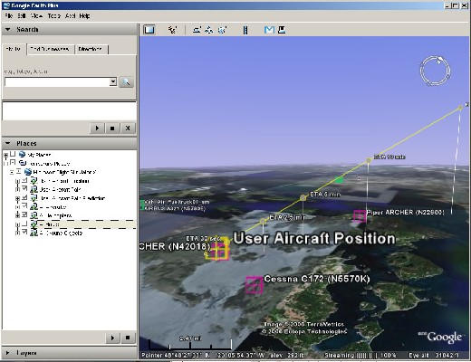
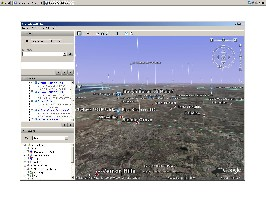
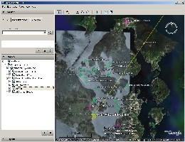

**Home** | **[Road Map](https://github.com/jtreml/fsxget/wiki/Road-Map)** | **[Screenshot Gallery](http://www.juergentreml.de/programming/fsx-google-earth-tracker#Gallery)** | **[News Archive](https://github.com/jtreml/fsxget/wiki/News-Archive)** | **[Help, FAQ, HowTos](https://github.com/jtreml/fsxget/wiki/Help,-FAQ-&-HowTos)** | **[Contact & Support](https://github.com/jtreml/fsxget/wiki/Contact-&-Support)**

# FSX Google Earth Tracker
**F**light **S**imulator **X** **G**oogle **E**arth **T**racker
**FSXGET**

[Latest News](#News), [Project Overview](#Project), [Screenshots](#Screenshots), [Feature Overview](#Features), [Links](#Links)

<strike>**Important: I'm currently looking for screenshots and pictures of FSX boats and ground vehicles to integrate them with FSXGET. Anyone any pictures?!? Please send them to [juergen@fsxget.com](mailto:juergen@fsxget.com) together with the type of boat or vehicle as shown in FSXGET if possible (e.g. wash_ferry_sm, ferry2, VEH_water_cruiseship2_sm, ...). I'd really appreciate your help!**</strike>

## <a name="News">Latest News</a>

- FSXGET 0.1 Beta 3 released. Contains new GUI features and major bugfixes.
See release notes for more details.

- FSXGET 0.1 Beta 2 released. Contians checks for operation system and 
service pack versions, check and auto-install for SimConnect and selectable
units for altitude, etc. (meters or feet)

- FSXGET 0.1 Beta 1 released. Supports easy configuration of FSXGET and
Google Earth running on one computer and FSX running on another. The
HowTo article on setting up this configuration has been updated, too.

- After a long break, a new release candidate has been published today
correcting two bug regarding x64 and non-English systems.

See a list of all past news on the [news site](News-Archive).

## <a name="Project">Project Overview</a>

FSXGET is a little tool that enables Google Earth to show Flight Simulator X user aircraft and AI object positions and course predictions.

Although FSX's internal world map has been improved compared to former versions, it is, not at last due to being an offline world map, still far away from Google Earth's map quality. That's why FSXGET tries to link the two, i.e. extract the simulation data from FSX and provide it to Google Earth to display it.

The tool which originally started as an extremly tiny experiment, trying nothing but to show the user aircraft's position in Google Earth has grown a lot and started to support AI Aircrafts, Boats, Ground Vehicles as well. Course prediction mechanisms have been added and most recently also functionality to display flight plans.

Finally in January 2007 it had been decided to publish the application as open source. Since then, the project is being hosted here on <strike>CodePlex</strike> GitHub. You can still visit the [original page](http://www.juergentreml.de/fsxget/) and leave your comments there. The <strike>[CodePlex discussion page](http://www.codeplex.com/fsxget/Thread/List.aspx)</strike> [GitHub issue page](https://github.com/jtreml/fsxget/issues) is another option to leave your comments.

Just to clear up any confusion, the following pages are now hosted on CodePlex:
* The [old forum](http://www.juergentreml.de/forum/index.php?board=4.0) is replaced by the <strike>[CodePlex discussion page](http://www.codeplex.com/fsxget/Thread/List.aspx)</strike> [GitHub issue page](https://github.com/jtreml/fsxget/issues).
* The [former screenshot gallery](http://www.juergentreml.de/joomla/index.php?option=com_gallery2&Itemid=99999999&g2_itemId=2027&g2_highlightId=2028) can now be found [here](http://www.juergentreml.de/programming/fsx-google-earth-tracker#Gallery).
* All former, present and future download are / will be availbale for download at the [releases page](https://github.com/jtreml/fsxget/releases) on <strike>CodePlex</strike> GitHub.
The old forum and former screenshots site are no longer available.

## <a name="Screenshots">Screenshots</a>

<table>
  <tr>
    <td colspan="2" align="center">
        
    </td>
  </tr>
  <tr>
    <td align="center">
        
    </td>
    <td align="center">
        
    </td>
  </tr>
</table>

For more screenshots, have a look at the [screenshot gallery](http://www.juergentreml.de/programming/fsx-google-earth-tracker#Gallery).

## <a name="Features">Feature Overview</a>

### Current Features

* Display user aircraft position (incl. details like altitude, speed, ...)
* Show  AI planes, helicopters and boats
* Show user aircraft flight path
* Display course and ETA predictions for user as well as AI aircrafts
* Show object images and ATC information

* Run FSXGET and Google Earth on different computers
* Customize server port and access (e.g. localhost only, ...)
* Cusotmize Google Earth refresh rates
* Automatic FSX startup detection
* Quick access by means of an icon in the system tray

* Completely written in managed code (C#) using managed API for FSX

### Upcoming Features

* Logging of flights for later view in Google Earth
* Automatic online update
* Show flight plans in Google Earth
* Automatically adjust viewing position and angles in Google Earth

## <a name="Links">Links</a>

* [Old Project Homepage](http://www.juergentreml.de/fsxget/)

* [Google Earth](http://earth.google.com/)
* [Microsoft Flight Simulator X](http://www.microsoft.com/games/pc/flightsimulatorx.aspx)
